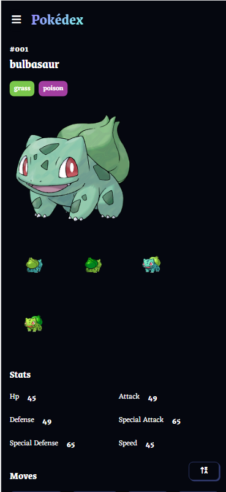
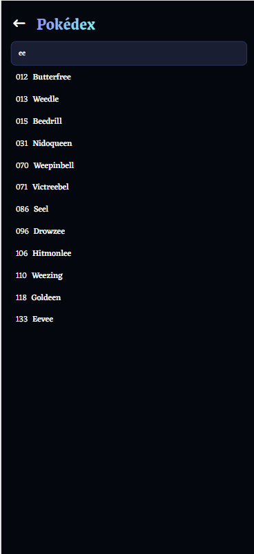
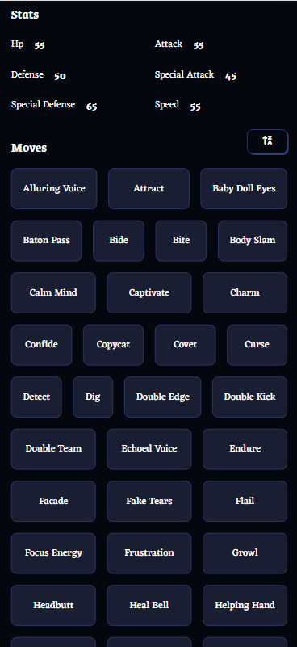
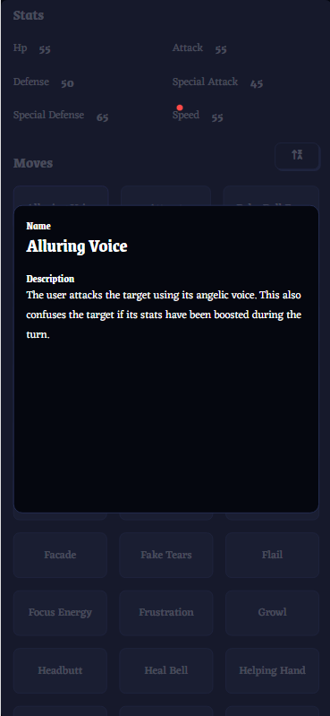
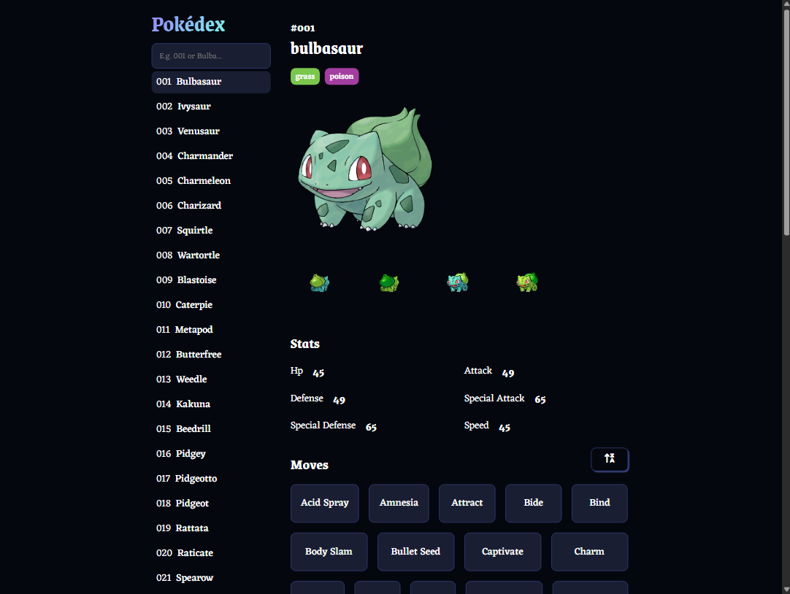
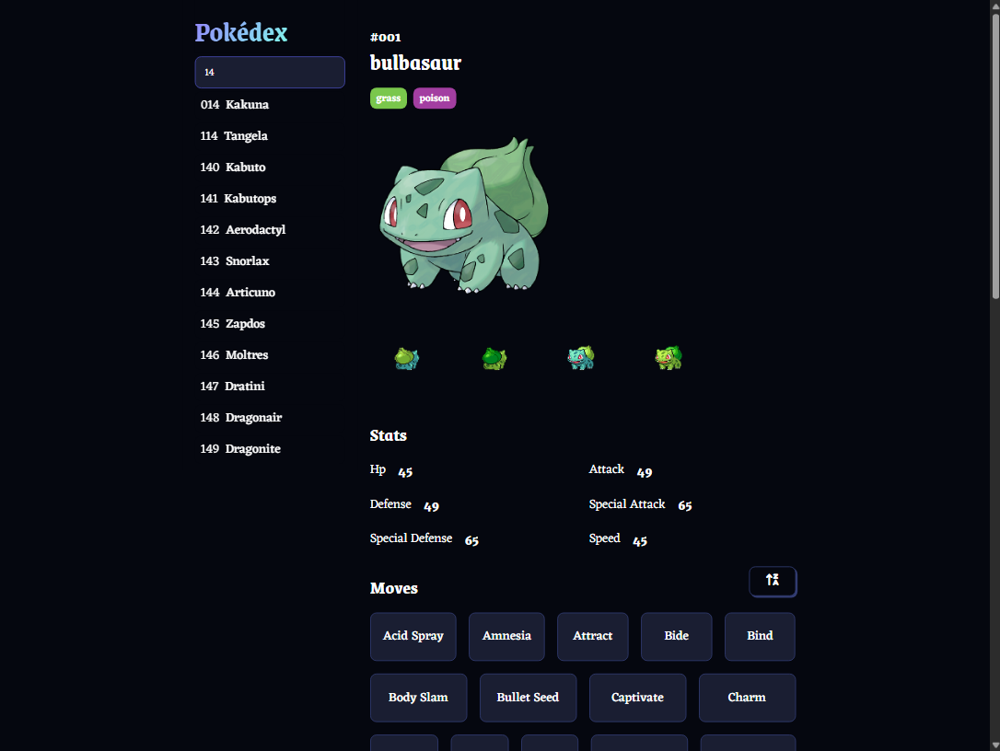
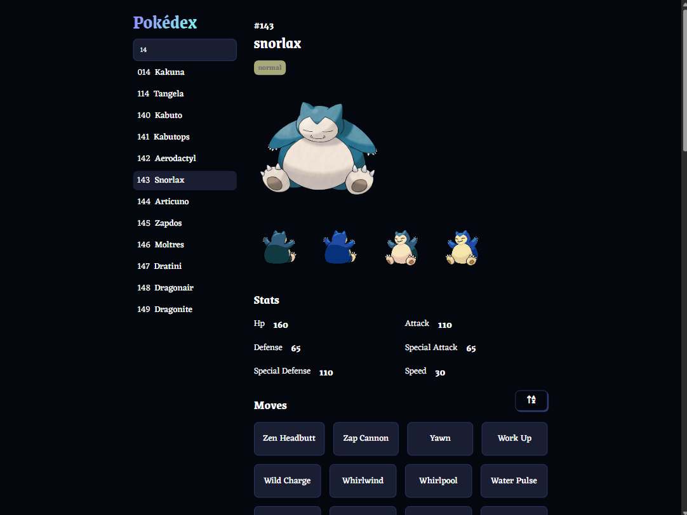
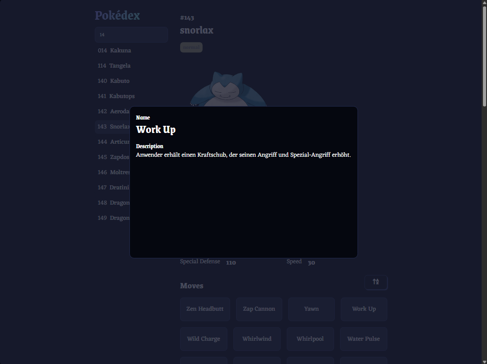

# ReactJS Pokédex

Code along with [jamezmca](https://github.com/jamezmca)

## Features

- Search Pokémons by number or name
- Show moves in modal
- Responsive design
- **[New]** Sort moves alphabetically

## Solutions

- Use `useMemo` to improve performance

## Images

Mobile

  
  
  
  

  

 

Desktop

  
  

  
  

